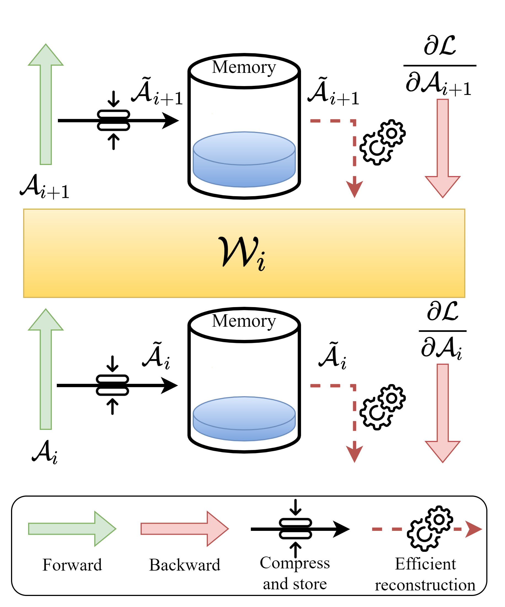
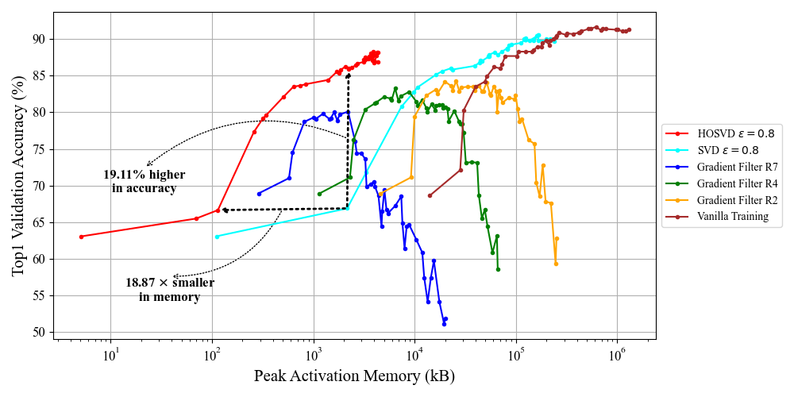

# Activation Map Compression through Tensor Decomposition for Deep Learning

> Le-Trung Nguyen, Aël Quélennec, Enzo Tartaglione, Samuel Tardieu, Van-Tam Nguyen

Official repository for the paper `Activation Map Compression through Tensor Decomposition for Deep Learning` accepted in NeurIPS 2024.

<details><summary>Abstract</summary>

Internet of Things and Deep Learning are synergetically exponentially growing industrial fields with a massive call for their unification into a common framework called Edge AI. While on-device inference is a well-explored topic in recent research, backpropagation remains an open challenge due to its prohibitive computational and memory costs compared to the extreme resource constraints of embedded devices. Drawing on tensor decomposition research, we tackle the major bottleneck in backpropagation, namely the memory footprint of activation map storage. We investigate and compare the effects of activation compression using Singular Value Decomposition and its tensor variant, High-Order Singular Value Decomposition. The application of low-order decomposition enables considerable memory savings while preserving the features being essential for learning, providing as well theoretical guarantees to convergence. Experimental results obtained on main-stream architectures and tasks demonstrate its Pareto-superiority over other state-of-the-art solutions, in terms of the trade-off between generalization and memory footprint.

</details>

## Features
### Activation map compression
Backpropagation is the most memory-intensive process during the training of a deep learning model. Inspired by tensor decomposition methods, we propose a technique that compresses activation maps, reducing the memory required for backpropagation while preserving the generalization capability of the deep neural network. Our approach adaptively retains most of the variance in the tensors, providing guarantees regarding the error in gradient estimation.

<p align="center">
  
</p>

### Significantly better Pareto curve (Memory vs. Accuracy)
Our method (HOSVD and SVD) does not accumulate errors as gradients propagate deeper (when fine-tuning more layers). Furthermore, fine-tuning all layers using our method (HOSVD) consumes less memory than fine-tuning only a single layer with Vanilla Training.

<p align="center">
  
</p>


## Environment Setup
> Experiments were conducted on Ubuntu 22.04.4 LTS.

1. Install the Miniconda environment by following the instructions [here](https://docs.anaconda.com/miniconda/)

2. Create and activate conda virtual environment

```
conda create -n activation_compression python=3.8
conda activate activation_compression
```
3. Install requirements

```
pip install -r requirements.txt
```
4. Install CUDA 11.7

```
conda install -c "nvidia/label/cuda-11.7.1" cuda-toolkit
```

5. Install PyTorch 1.13.1

```
conda install pytorch==1.13.1 torchvision==0.14.1 pytorch-cuda=11.7 -c pytorch -c nvidia
```

### Classification

0. Make sure to be inside [classification](classification/) folder

```
cd classification
```

1. Install dependencies for the classification task

```
pip install "jsonargparse[signatures]" pytorch_lightning==1.6.5 torchmetrics==0.9.2 pretrainedmodels
```

2. Prepare checkpoints for setup B

```
gdown https://drive.google.com/uc?id=1N2lOOxaepwbEuwIi7xEEBZwov8pb3jEJ
tar xzvf cls_pretrained_ckpts.tar.gz
rm cls_pretrained_ckpts.tar.gz
```

3. Running experiments

  

In the [scripts](classification/scripts) directory, you can find pre-configured bash files to run the corresponding experiments. For example, to run experiments with MobileNetV2 using the HOSVD filter with $\varepsilon=0.8$, use [`c10_mbv2_var0.8.sh`](classification/scripts/HOSVD/mbv2/c10_mbv2_var0.8.sh):

  

```bash
bash  scripts/HOSVD/mbv2/c10_mbv2_var0.8.sh
```

**Note:** For more details regarding experiment setup changes and logging activation memory, please refer to [here](classification/README.md).

  

### Segmentation

0. Make sure to be inside [segmentation](segmentation/) folder

```
cd segmentation
```

1. Install dependencies for semantic segmentation

```
pip install openmim
mim install mmcv-full==1.6.1
cd mmsegmentation
pip install -e .
cd ..
```

2. Prepare dataset

```
wget http://host.robots.ox.ac.uk/pascal/VOC/voc2012/VOCtrainval_11-May-2012.tar
tar xvf VOCtrainval_11-May-2012.tar
rm VOCtrainval_11-May-2012.tar

wget https://www2.eecs.berkeley.edu/Research/Projects/CS/vision/grouping/semantic_contours/benchmark.tgz
tar xvf benchmark.tgz
rm benchmark.tgz

mkdir mmsegmentation/data
mkdir VOCdevkit/VOCaug
mv benchmark_RELEASE/dataset VOCdevkit/VOCaug
mv VOCdevkit mmsegmentation/data

cd mmsegmentation
python tools/convert_datasets/voc_aug.py data/VOCdevkit data/VOCdevkit/VOCaug --nproc 8

mv data ./../
cd ..

rm -r benchmark_RELEASE
```

3. Prepare checkpoint

```
gdown https://drive.google.com/uc?id=1CxLWBcByKFS-Vv75VG70DWUX3EcFmSu1
tar xvf seg_calib_ckpt.tar.gz
rm seg_calib_ckpt.tar.gz
```

4. Running experiments

In the [scripts](segmentation/scripts) directory, you can find pre-configured bash files to run the corresponding experiments. For example, to run experiments with DeepLabV3 using the HOSVD filter with $\varepsilon=0.8$, use [`hosvd_dlv3_0.8.sh`](segmentation/scripts/dlv3/HOSVD/hosvd_dlv3_0.8.sh):

  

```bash
bash  scripts/dlv3/HOSVD/hosvd_dlv3_0.8.sh
```

**Note:** To measure activation memory, please refer to [here](segmentation/README.md)
